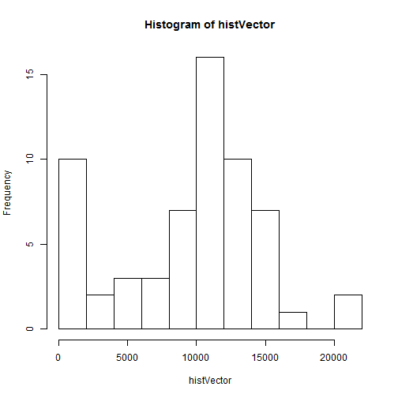
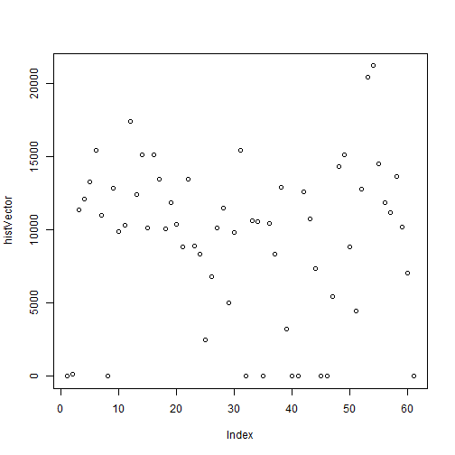
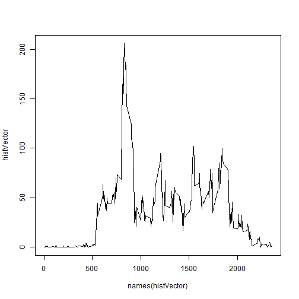
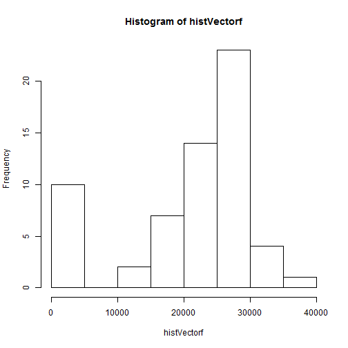
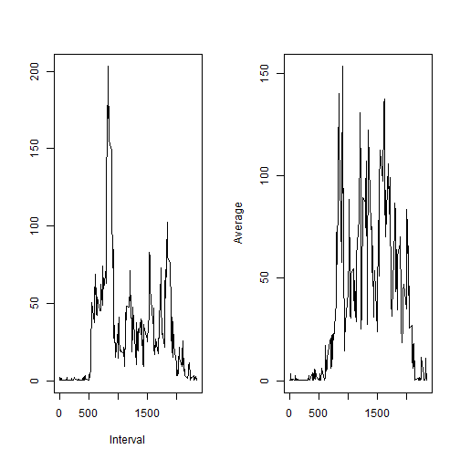

Show any code that is needed to

    Load the data (i.e. read.csv())

    Process/transform the data (if necessary) into a format suitable for your analysis


```r
activity <- read.csv("~/R/Coursera/Reproducible Research/repdata_data_activity/activity.csv")

activity$date<-as.character(activity$date)

getwd()
```

```
## [1] "C:/Users/Greg/Documents"
```
What is mean total number of steps taken per day?

For this part of the assignment, you can ignore the missing values in the dataset.

    Make a histogram of the total number of steps taken each day

    Calculate and report the mean and median total number of steps taken per day


```r
histVector<-c()

for(n in unique(activity$date)){
  histVector[n]<-sum(activity$steps[activity$date==n], na.rm=TRUE)
}


hist(histVector, breaks=10)
```

 

```r
plot(histVector)
```

 

```r
summary(histVector)
```

```
##    Min. 1st Qu.  Median    Mean 3rd Qu.    Max. 
##       0    6780   10400    9350   12800   21200
```

What is the average daily activity pattern?  
1. Make a time series plot (i.e. type = "l" ) of the 5-minute interval (x-axis) and the average number of steps taken, averaged across
all days (y-axis)

2. Which 5-minute interval, on average across all the days in the dataset, contains the maximum number of steps?

```r
histVector<-c()

for(n in unique(activity$interval)){
  histVector[n]<-mean(activity$steps[activity$interval==n], na.rm=TRUE)
}

histVector<-histVector[!is.na(histVector)]
histVector<-c(histVector,mean(activity$steps[activity$interval==0], na.rm=TRUE))
names(histVector)<-unique(activity$interval)
plot(names(histVector),histVector, type="l")
```

 

```r
MaxOp<-max(histVector, na.rm=TRUE)
MostAct<-names(histVector[order(histVector, decreasing=TRUE)[1]])
MostAct
```

```
## [1] "830"
```

1. Calculate and report the total number of missing values in the dataset (i.e. the total number of rows with NA s)

2. Devise a strategy for filling in all of the missing values in the dataset. The strategy does not need to be sophisticated. For example, you could use the mean/median for that day, or the mean for that 5-minute interval, etc.  Here I chose the 5 minute interval.

3. Create a new dataset that is equal to the original dataset but with the missing data filled in.

4. Make a histogram of the total number of steps taken each day and Calculate and report the mean and median total number ofsteps taken per day. Do these values differ from the estimates from the first part of the assignment? What is the impact of imputing missing data on the estimates of the total daily number of steps?


```r
 sum(is.na(activity$steps))
```

```
## [1] 2304
```

```r
 fillNA<-c()
for (n in 1:length(activity$steps)) {

   if(is.na(activity$steps[n])) {
     
  fillNA<-rbind(fillNA, 
                c(mean(activity$steps[activity$interval==activity$interval[1]], na.rm=TRUE),activity$date[n],activity$interval[n]))
                }
  
   else {
     fillNA<-rbind(fillNA,
                c(activity$steps[n],activity$date[n],activity$interval[n]))
     }
  }

fillNA<-data.frame(fillNA)
colnames(fillNA)<-c("steps","date", "interval")

histVectorf<-c()
factivity<-fillNA

for(n in unique(factivity$date)){
  histVectorf[n]<-sum(as.numeric(factivity$steps[factivity$date==n], na.rm=TRUE))}


hist(histVectorf, breaks=10)
```

 

```r
summary(histVectorf)
```

```
##    Min. 1st Qu.  Median    Mean 3rd Qu.    Max. 
##     864   17400   24000   20900   26900   35200
```

For this part the weekdays() function may be of some help here. Use the dataset with the filled-in missing values for this part.  

1. Create a new factor variable in the dataset with two levels – "weekday" and "weekend" indicating whether a given date is a weekday or weekend day.  

1. Make a panel plot containing a time series plot (i.e. type = "l" ) of the 5-minute interval (x-axis) and the average number of steps taken, averaged across all weekday days or weekend days (y-axis). 


```r
fillNA$wkdys<-weekdays(as.Date(fillNA$date))

day<-c()
test<-(weekdays(as.Date(fillNA$date)) %in% c("Sunday", "Saturday"))
for (n in test){
  if(n) day<-c(day,"weekend") else day<-c(day,"weekday")  
  }

fillNA$day<-day

WkdayStep<-c()
WkdayStepv<-c()
WkdayStep<-fillNA[fillNA$day=="weekday",]
wkendStep<-c()
wkendStepv<-c()
wkendStep<-fillNA[fillNA$day=="weekend",]

for(n in unique(WkdayStep$interval)){
  WkdayStepv[n]<-mean(as.numeric(as.character(WkdayStep$steps[WkdayStep$interval==n])))
  
}

for(n in unique(wkendStep$interval)){
  wkendStepv[n]<-mean(as.numeric(as.character(wkendStep$steps[wkendStep$interval==n])))
  
}

par(mfrow=c(1,2)) 
plot(names(WkdayStepv),WkdayStepv, type="l", xlab="Interval", ylab="")

plot(names(wkendStepv),wkendStepv, type="l",  ylab="Average",xlab="" )
```

 
